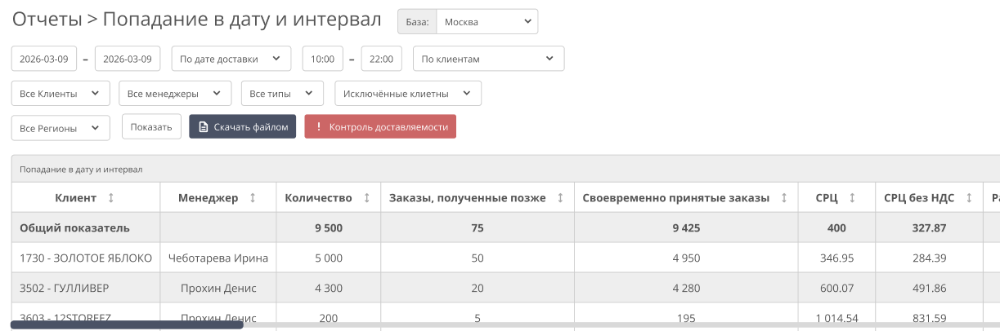
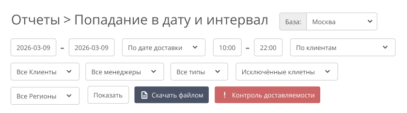
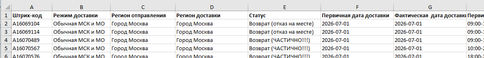
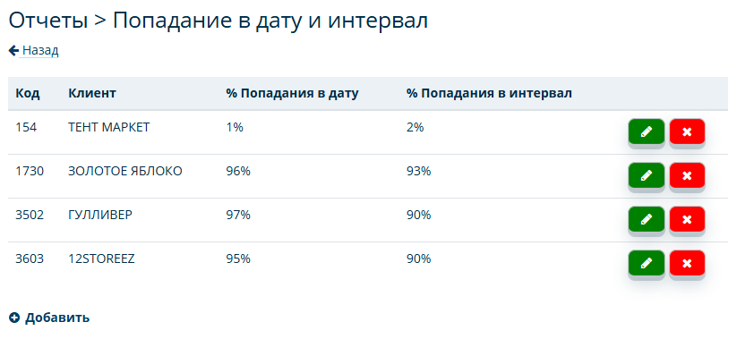
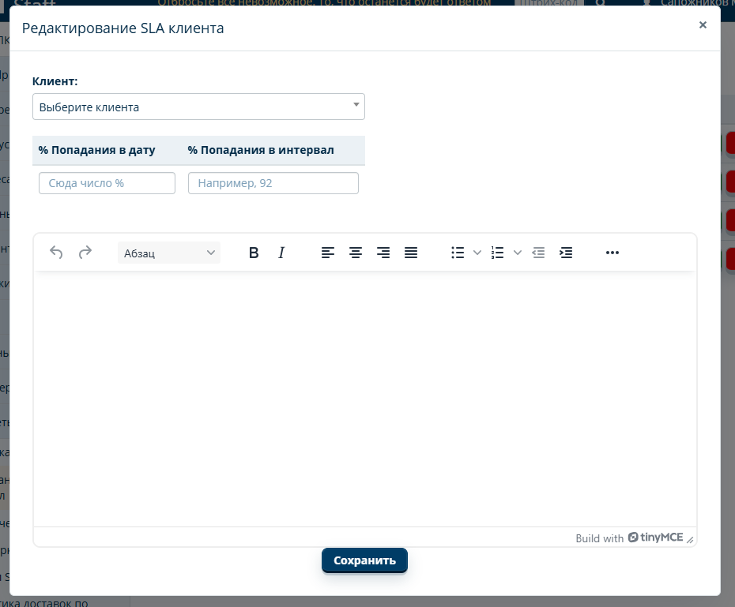
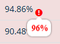

# Попадание в дату и интервал

## Цель
Разработка инструмента для анализа и контроля попаданий заказов в сроки доставки.

## Основные задачи
1. Создать новый раздел в Staff: **Отчёты - Попадание в дату и интервал**.
   
2. Создать панель управления с переключателями, фильтрами и кнопками действий.
   
3. Создать таблицу с агрегированными данными.
   
4. Предоставить возможность экспорта данных в формат `.xlsx`.
   
5. Добавить возможность индивидуальной настройки по клиенту, для визуального выделения строк, если SLA опускается ниже заданного порога.
   
6. Добавить возможность указания комментария по клиенту.

## Глоссарий
**Первичная дата/интервал** - Дата/Интервал доставки, указанные Клиентом при создании заказа.

**Плановая дата/интервал** - Дата/Интервал доставки указанная в карточке заказа.

**Фактическая дата/время** - Дата и время проставления курьером статуса: «Доставлено», «Частично доставлено» либо «Не доставлен» с причиной «Отказ…».

**SLA** - обязательства по соблюдению сроков доставки.

## Панель управления 
В верхней части страницы располагается Панель инструментов, позволяющая настраивать отображение данных в таблице. Панель управления состоит из:
- Переключателей
- Фильтров
- Кнопок действия

### Переключатели
- **База МСК / СПБ** - Переключение между базами. Меняет доступный список клиентов, менеджеров, режимов.

- **По Клиентам / По Регионам** - определяет способ группировки данных в таблице.
  - **По Клиентам** - Вывод происходит в разрезе клиентов. Регионы агрегированы внутри карточки клиента.
  - **По Регионам** - Вывод происходит в разрезе регионов доставки. Клиенты агрегированы внутри региона.

- **По дате доставки / По дата вручения** - Выбор основания для расчёта **Периода**
  - **По дате доставки** - Используется **Плановая дата** доставки
  - **По дата вручения** - Используется **Фактическая дата** доставки.
  
---

### Фильтры
Все фильтры применяются по логике **"И"**. Если комбинация фильтров не даёт результатов, таблица не формируется.

- **Период** - Диапазон дат "с" и "до". Выбор через всплывающий календарь.
  
- **Интервал** - диапазон первичных интервалов доставки. Задаётся двумя ячейками "с" и "до" с шагом 1 час (8:00–23:00). 
  - **«Все»** - отображаются заказы с любым интервалом.
  - **При указании диапазона** - только заказы, у которых данный интервал является **Первичным**.
  
- **Клиенты** -  множественный выбор (чипсы) с поиском внутри выпадающего списка. Поддерживается одиночное и массовое удаление. Пусто = все клиенты. При выборе - только указанные.
  
- **Исключённые клиенты** - множественный выбор (чипсы) с поиском внутри выпадающего списка. Пусто = никто не исключён. Не применяется, если заполнен фильтр **"По клиентам"**
  
- **Менеджеры** - множественный выбор (чипсы) с поиском внутри выпадающего списка. Пусто = все. При выборе - только клиенты указанных менеджеров по сопровождению.
  
- **Регионы** - множественный выбор (чипсы) с поиском внутри выпадающего списка. Пусто = все. При выборе - только указанные регионы доставки
  
- **Типы** - множественный выбор (чипсы, с поиском): A, B, C, D, VIP. Пусто = все. При выборе - только указанные типы клиентов.

---

### Кнопки
- **Показать** - формирует таблицу в соответствии с заданными параметрами панели управления.
  
- **Скачать файлом** - экспорт отчёта в `.xlsx` с содержанием тех же данных и структурой, что отображаются веб-таблице.
  
- **Контроль по SLA** - открывает окно настройки контроля SLA по клиенту и указания комментария.

## Структура таблицы
- При входе в раздел **«Попадание в дату и интервал»** таблица не формируется автоматически. Данные загружаются только при нажатии кнопки **«Показать»**.

- Данные в таблице формируются на основании настроек в **Панели управления**.

- Предусмотреть горизонтальную прокрутку таблицы для масштабирования без обрезки названий столбцов.
  
- **Первая строка таблицы:** **"Общий показатель"** - Отображает общую метрику по всем данным таблицы. Зафиксирована и не сортируется.

- **Последующие строки:**  Детализация, где каждая строка соответствует одному клиенту или одному региону, в зависимости от выбранного режима.

### Столбцы таблицы
**Переключатель "По Клиентам"**
1. Клиент
2. Менеджер

**Переключатель "По Регионам"**
1. Регион доставки

---

**Общие столбцы**
1. **Количество** - Общее количество заказов
   
2. **Заказы, полученные позже** - Количество заказов, принятых на склад после 10:00 в первичную дату доставки.
   
3. **Своевременно принятые заказы** - `Количество - Заказы, полученные позже`.
   
4. **СРЦ** - `Стоимость доставки Заказа / Количество`
   
5. **СРЦ без НДС** - `СРЦ / (1 + Ставка НДС)`
   
6. **Раньше даты** - Количество заказов, доставленных раньше **Первичной даты.**
   
7. **Раньше даты, %** - `(Раньше даты / Своевременно принятые заказы) * 100%`
   
8.  **Попадание в дату** - Доставлено в **Первичную дату**
   
9.  **Попадание в дату, %** - `(Попадание в дату / Своевременно принятые заказы) * 100%`
    
10. **Позже даты** - Доставлено позже **Первичной даты**.
    
11. **Раньше интервала** - Доставлено в **Первичную дату**, но раньше **Первичного интервала**
    
12. **Раньше интервала, %** - `(Раньше интервала / Попадание в дату) * 100%`
    
13. **Попадание в интервал** - Доставлено в первичную дату и в первичный интервал.
    
14. **Попадание в интервал, %** - `(Попадание в интервал / Попадание в дату) * 100%`
    
15. **Позже интервала** - доставлено в **Первичную дату** позже согласованного интервала, либо доставлено в другую дату.
    
16. **Частота доставляемости в срок в дату** - `Количество / (Позже даты)`. Если знаменатель равен 0, значение = `Количество`.

17. **Частота доставляемости в срок в дату, %** - `(Количество / Частота доставляемости в срок в дату / Количество) * 100%`. Если знаменатель равен 0, значение = `100%`.

18. **Частота доставляемости в срок в интервал** - `Количество - Позже даты / Позже интервала`. Если знаменатель равен 0, значение = `Количество`.

19. **Процент частоты доставляемости в интервал** - `(Количество / Частота доставляемости в срок в интервал / Количество) * 100%`. Если знаменатель равен 0, значение = `0%`.
    
20. **Скачать** - `.xlsx` с детализацией по строке

### Особенности при формировании "Общего показатели"
Количество заказов по всем столбцам суммируются. Процентные и расчётные показатели вычисляются заново на основе полученных сумм, а не усредняются по строкам.

Кнопка **«Скачать»** для строки "Общий показатель" не предусмотрена.

### Состав файла детализации (кнопка "Скачать" в строке)
Каждая строка файла - отдельный Клиент / регион из отчёта. В экспорт попадают все заказы. Столбцы:

1. Штрих-код
2. Режим доставки
3. Регион отправления
4. Регион доставки
5. Статус корреспонденции
6. Первичная дата доставки
7. Фактическая дата доставки
8. Первичный интервал доставки
9. Фактическое время доставки
10. Стоимость доставки 
11. Нужный день
    - **Да** - если дата проставления финального статуса курьером соответствует первичной дате доставки
    - **Нет** - в иных случаях
  
12. Нужный интервал
    - **Да** - если дата и время проставления финального статуса курьером соответствуют первичной дате и первичному интервалу доставки
    - **Нет** - в иных случаях

### Сортировка
Строки клиентов, добавленных в "Контроль по SLA", всегда отображаются в верхней части таблицы. Сортировка применяется внутри этой группы и отдельно внутри остальных строк.

## Исходные данные и ограничения

### Склейка баз МСК и СПБ
Для заказов, дублирующихся в базах МСК и СПБ, отчёт склеивает записи по **штрихкоду**. Система определяет, в каком техническом кабинете есть данные курьера, и использует их (дату, время доставки, статус и причину со слов курьера) в отчёте по Клиенту. В выгрузке детализации такие заказы также участвуют.

### НДС
Для всех расчётов, связанных с НДС, применяется ставка, закреплённая за клиентом.

### Участвующие заказы
В отчёте участвуют только заказы, поступившие на склад. Все остальные исключаются.

### Исключённые клиенты (технические)
| База МСК | База СПБ |
|----------|----------|
| ТЕСТ | ДС-СПБ ООО |
| ДАЛЛИ-СЕРВИС | ДАЛЛИ-СЕРВИС МСК |
| УДАЛЕНИЕ ЗАЯВОК МСК | ДАЛЛИ-СЕРВИС МСК РКО!!! |
| ДАЛЛИ-СЕРВИС СПБ | ТЕСТ |
| ДАЛЛИ-СЕРВИС СПБ РКО | ДАЛЛИ-СЕРВИС МСК РКО NOT_PREPAY!!! |

### Режимы доставки, участвующие в отчёте
| База МСК | База СПБ |
|----------|----------|
| Обычная МСК и МО | Обычная МСК и МО |
| Экспресс МСК | Экспресс СПБ |
| Срочная МСК | Срочная SPB |
| ПВЗ МСК | ПВЗ МСК |
| Обычная СПБ и ЛО | Обычная СПБ и ЛО |
| ПВЗ СПБ | ПВЗ СПБ |
| Курьерская Регионы | Курьерская Регионы |
| ПВЗ Регионы | ПВЗ Регионы |
| Внутригородская Регионы | Внутригородская Регионы |
| Доставка КГТ | Доставка КГТ |
| Доставка МП | Доставка МП |
| Внутрирегиональная доставка | Внутрирегиональная доставка |
| Доставка КГТ Регион | Доставка КГТ Регион |

## Кнопка «Контроль по SLA»

### Назначение
Открывает раздел для индивидуальной настройки порогов SLA по клиентам. Если показатель опускается ниже заданного порога - строка подсвечивается.

### Раздел настройки

Содержит таблицу с уже добавленными клиентами и столбцами:
1. Код клиента
2. Клиент
3. % Попадания в дату
4. % Попадания в интервал
5. Действия (Редактировать / Удалить)

Под таблицей - кнопка **«Добавить»**.

### Модальное окно (добавление / редактирование)

- **Выбор клиента** (при редактировании подставляется автоматически).
- **Пороговые значения:**
  - % Попадания в дату - ввод числа, знак `%` подставляется автоматически.
  - % Попадания в интервал - ввод числа, знак `%` подставляется автоматически.
- **Комментарий** - текстовый редактор с возможностью форматирования текста

### Логика работы
Если в отчёте **"По Клиенту"** значение столбца **Попадание в дату, %** или **Попадание в интервал, %** ниже заданного порога:
- Строка окрашивается в красный.
- Появляется значок `!`, при наведении на который, отображается подсказка с требуемым значением.

### Отображение комментария
Комментарий к клиенту показывается под таблицей, только если отчёт сформирован по одному клиенту (клиент выбран в фильтре).

## Пользовательский сценарий
1. Пользователь заходит в раздел **Отчёты - Попадание в дату и интервал**.
2. Выбирает базу (МСК / СПБ) и режим отображения (По Клиентам / По Регионам).
3. Настраивает фильтры: Период, Интервал, Клиенты и т.д.
4. Нажимает **«Показать»** - формируется таблица.
5. При необходимости настраивает контроль SLA через кнопку **«Контроль по SLA»**.
6. Может скачать отчёт или детализацию по строке через кнопки **«Скачать файлом»** / **«Скачать»**.

## Не входит в разработку
- Выбор и исключение режимов доставки (Обычная МСК и МО, Курьерская Регионы и т.д.)
- Выбор определённых статусов курьера
- Детализация по партнёрским заказам
- Графики с динамикой доставляемости
- Уведомления в Telegram / Staff о низком SLA